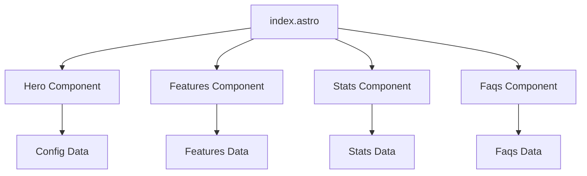

# System Patterns - Instalaciones Eléctricas y Solares

## Arquitectura del Sistema
El proyecto utiliza una arquitectura basada en componentes modulares con Astro JS, siguiendo las mejores prácticas del framework.

### Estructura de Componentes
```
src/
├── components/
│   ├── sections/          # Componentes de sección de página
│   │   ├── Hero.astro     # Cabecera principal
│   │   ├── Features.astro # Lista de servicios/features
│   │   ├── Stats.astro    # Estadísticas y resultados
│   │   └── Faqs.astro     # Preguntas frecuentes
│   ├── forms/            # Formularios
│   │   └── Contact.astro # Formulario de contacto
│   ├── ui/               # Componentes UI básicos
│   └── blog/             # Componentes de blog (potencial uso futuro)
```

### Flujo de Datos
- **Configuración centralizada**: Datos en `src/data/` (config.ts, features.ts, faqs.ts, etc.)
- **Props drilling**: Los componentes reciben datos mediante props
- **Separación clara**: Contenido separado de la presentación

## Patrones de Diseño Implementados

### 1. Component-Based Architecture
- Componentes modulares y reutilizables
- Separación de responsabilidades claras
- Fácil mantenimiento y escalabilidad

### 2. Configuration-Driven Content
- Contenido gestionado mediante archivos de configuración TypeScript
- Fácil actualización sin modificar código
- Soporte multi-idioma potencial

### 3. Responsive Design Patterns
- Diseño mobile-first
- Breakpoints consistentes en todo el sistema
- Componentes que se adaptan automáticamente

### 4. Performance Optimization
- Astro's islands architecture para interactividad mínima
- Assets optimizados y lazy loading
- SEO built-in con meta tags configurables

## Relaciones entre Componentes Críticos

### Página Principal (`index.astro`)


### Configuración y Datos
- `config.ts`: Información general de la empresa y SEO
- `features.ts`: Lista de servicios eléctricos y solares
- `faqs.ts`: Preguntas frecuentes del sector
- `stats.ts`: Estadísticas de resultados y experiencia

## Patrones de Implementación Críticos

### Gestión de Estado
- Estado mínimo (Astro es principalmente estático)
- Props para comunicación entre componentes
- Configuración global accesible desde cualquier componente

### Estilos y Temas
- Sistema de temas predefinidos (basado en Titan Core)
- Variables CSS consistentes
- Diseño responsive integrado

### Optimizaciones de Rendimiento
- Zero JavaScript por defecto (añadir solo donde necesario)
- Imágenes optimizadas y responsive
- Critical CSS inlined
- Lazy loading de componentes no críticos

## Extensiones y Personalizaciones

### Personalizaciones Realizadas
- Adaptación de contenidos para sector eléctrico/solar
- Configuración de contactos y redes sociales
- SEO optimizado para búsquedas locales

### Extensiones Potenciales
- Integración con CMS para gestión de contenido
- Sistema de citas online
- Calculadora de ahorro energético
- Galería de proyectos
- Sistema de testimonios

## Decisiones Arquitectónicas Clave
1. **Astro sobre React/Vue**: Mejor rendimiento para landing pages
2. **TypeScript**: Type safety para configuración y datos
3. **Componentes modulares**: Fácil mantenimiento y actualizaciones
4. **Configuración centralizada**: Contenido fácilmente editable
5. **Mobile-first**: Prioridad experiencia móvil (donde ocurren más contactos)
